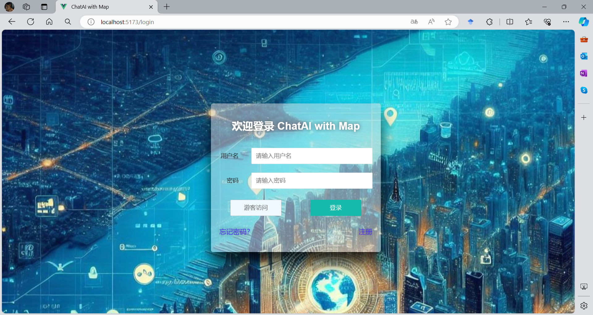
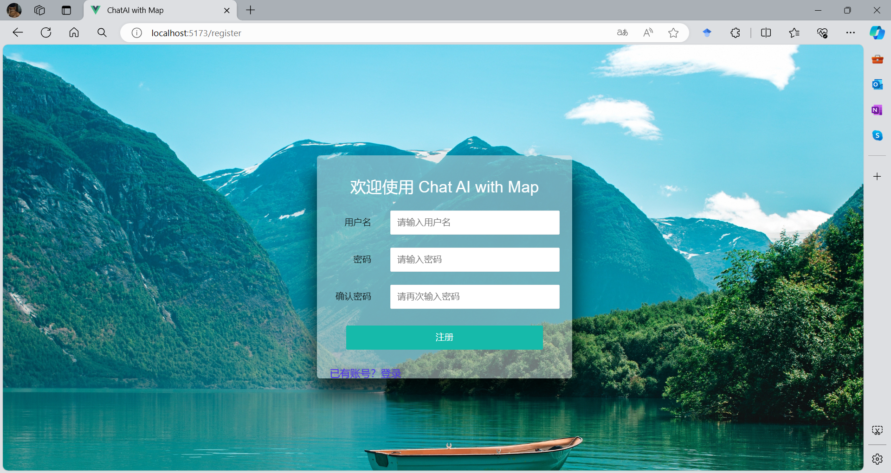
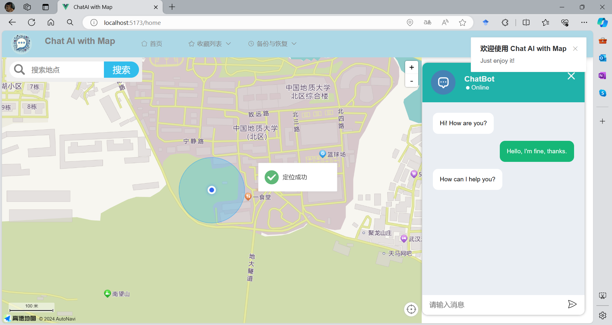
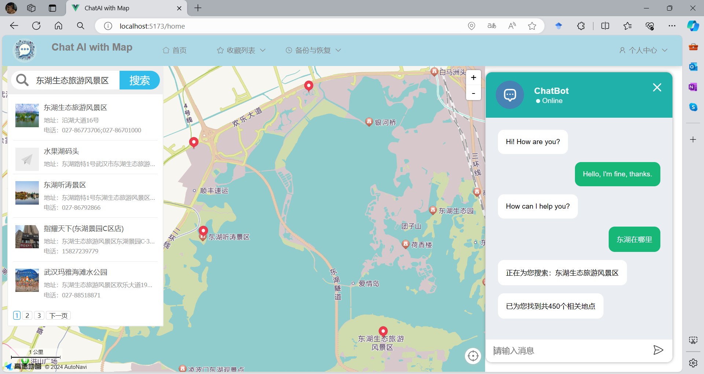
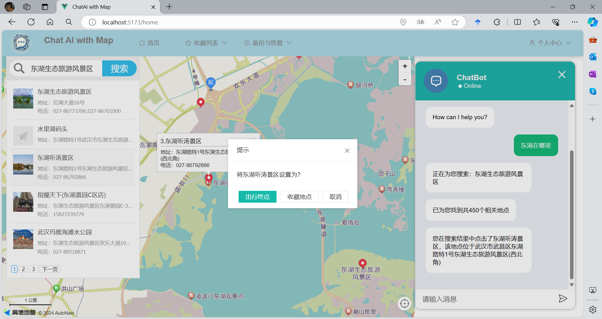
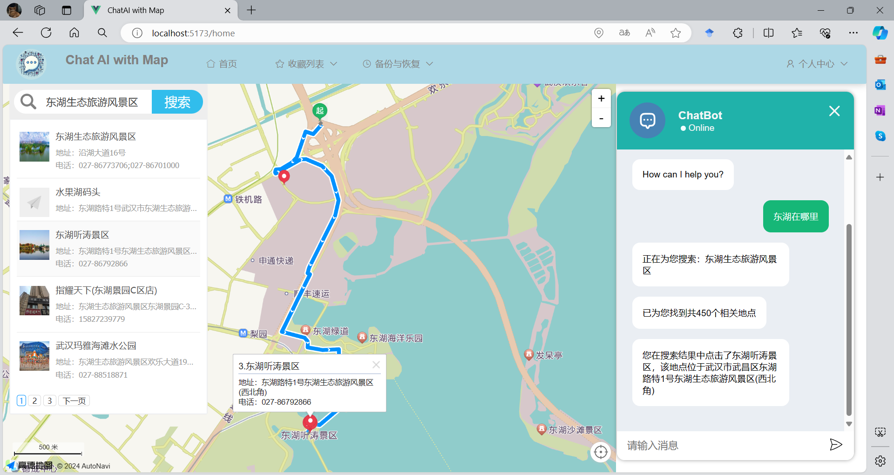

# Chat AI with Map
> 这是一款使用团队自定义推荐模型，利用大模型和地图进行交互的地图可视化系统

## 示例
> 历史版本：[历史版本](/edition.md)  
> 第四版：  
> 1. 登录与注册  
>   
>   
> 2. 使用
> 
> 
> 
> 

## 准备
[VSCode](https://code.visualstudio.com/) + [Volar](https://marketplace.visualstudio.com/items?itemName=Vue.volar) (and disable Vetur) + [TypeScript Vue Plugin (Volar)](https://marketplace.visualstudio.com/items?itemName=Vue.vscode-typescript-vue-plugin).  

开发软件：VS Code + Volar插件  
浏览器：Edge or Chrome （IE8以上）+ vue插件

## 开始使用
### 填写key
[此处填写](./src/config/key.js) 
```js
export const robotUrl = ;
export const robotKey = ;
export const amapKey = ;
export const amapSecurityCode = ;
```
>- 高德地图 JS API  
>- 【新】天行机器人 API  
首先[申请](https://www.tianapi.com/)，搜索`天行机器人`，注册会员（实名认证可选），在`axios.get()`设置参数`key`
### Customize configuration
See [Vite Configuration Reference](https://vitejs.dev/config/).
1. Project Setup  
[创建一个vue应用](https://cn.vuejs.org/guide/quick-start.html)
```sh
npm install
```
2. 三方库
```sh
npm i @chat-ui/vue3
npm i @amap/map-jsapi-loader --save
npm install axios
npm install @layui/layui-vue --save
npm install vue-router
npm install vuex --save
```
3. Compile and Hot-Reload for Development
```sh
npm run dev
```
4. （可选）Compile and Minify for Production
```sh
npm run build
```

## 更新日志
- `2024.3.26`:  
> 1. 新增用户注册、登录功能；其他功能：聊天记录缓存与恢复、地点收藏、步行路径导航等。
> 2. 删除自动匹配关键词功能；
> 3. 优化UI
> 4. 引入vue-router和vuex，修改文件架构，优化代码
> 5. 已知问题：地点收藏存在bug
- `2024.03.08`:
> 1. 新增地图右键菜单功能和在周边搜索功能
> 2. 发现了一些玄学bug，将`2024.03.06`优化的代码进行部分还原
> 3. 在发现bug的同时，完善输入匹配搜索功能。这样就完成了`搜索框输入+回车`、`搜索框输入+点击自动匹配关键词`、`搜索框输入+点击搜索`、`聊天对话关键词匹配搜索`、`地图右键单击周边搜索`等多种搜索方式。
- `2024.03.06`:  
> 1. 使用layui，更改ui布局和样式
> 2. 修改一些逻辑上的bug
> 3. 优化代码
- `2024.02`：
> 1. 增加高德地图插件功能：地图定位
> 2. 更改项目文件结构，拟更改项目名为 `Chat AI with Map`
> 3. 更换聊天机器人api，使用[天行机器人](https://www.tianapi.com/apiview/47)
> 4. 更新ui布局
> 5. 初步完成聊天与地图交互功能
> 6. 更新文档
- `2023.11`：
> 1. 搭建页面基本架构
> 2. 初始化仓库

## 相关文档
- `@chat-ui/vue3`：https://www.npmjs.com/package/@chat-ui/vue3?activeTab=readme  
- `高德地图参考手册`：https://lbs.amap.com/api/javascript-api-v2/documentation  
- `layui - vue`：http://www.layui-vue.com/zh-CN/index

## 相关链接
`UrbanComp`：www.urbancomp.net