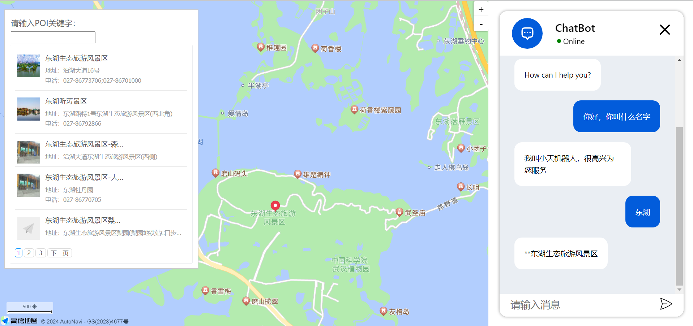

# Chat AI with Map
> 这是一款使用团队自定义推荐模型，利用大模型和地图进行交互的地图可视化系统

## 示例



## 准备
[VSCode](https://code.visualstudio.com/) + [Volar](https://marketplace.visualstudio.com/items?itemName=Vue.volar) (and disable Vetur) + [TypeScript Vue Plugin (Volar)](https://marketplace.visualstudio.com/items?itemName=Vue.vscode-typescript-vue-plugin).

开发软件：VS Code + Volar插件  
浏览器：Edge or Chrome （IE8以上）+ vue插件

## 开始使用
### 填写key
>- 高德地图 JS API  
[此处位置修改安全密钥](./src/component/MapContainer.vue)  
  
>- 【新】天行机器人 API  
首先[申请](https://www.tianapi.com/)，搜索`天行机器人`，注册会员（实名认证可选），在`axios.get()`设置参数`key`
### Customize configuration
See [Vite Configuration Reference](https://vitejs.dev/config/).
1. Project Setup
```sh
npm install
```
2. 三方库
```sh
npm i @chat-ui/vue3
npm i @amap/map-jsapi-loader --save
npm install axios
npm install @layui/layui-vue --save
```
3. Compile and Hot-Reload for Development
```sh
npm run dev
```
4. （可选）Compile and Minify for Production
```sh
npm run build
```

## 更新日志
- `2024.03`:  
> 1. 使用layui，更改ui布局和样式
> 2. 修改一些逻辑上的bug
> 3. 优化代码
- `2024.02`：
> 1. 更改vue文件架构，拟更改项目名为 `Chat AI with Map`
> 2. 更换聊天机器人api，使用[天行机器人](https://www.tianapi.com/apiview/47)
> 3. 增加高德地图插件功能：地图定位
> 4. 更新ui布局
> 5. 初步测试聊天与地图交互功能
> 6. 更新文档
- `2023.11`：
> 1. 搭建页面基本架构
> 2. 初始化仓库

## 相关文档
`@chat-ui/vue3`：https://www.npmjs.com/package/@chat-ui/vue3?activeTab=readme  
`高德地图参考手册`：https://lbs.amap.com/api/javascript-api-v2/documentation
`layui - vue`：http://www.layui-vue.com/zh-CN/index

## 相关链接
`UrbanComp`：www.urbancomp.net